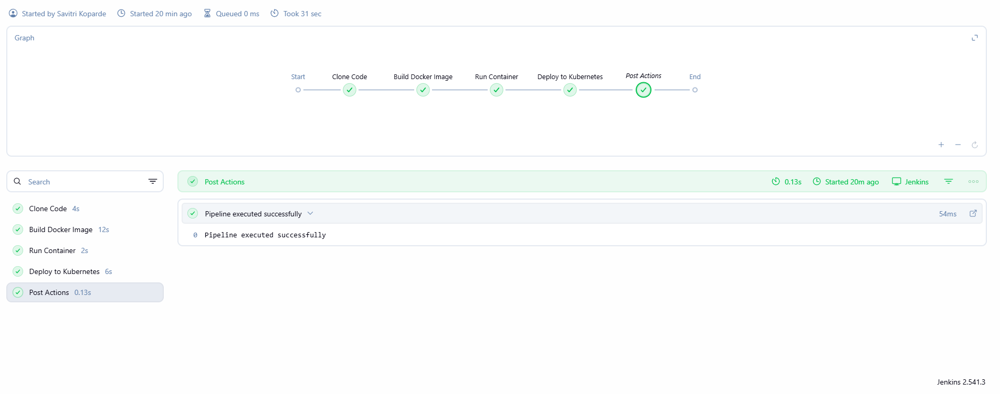
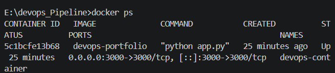
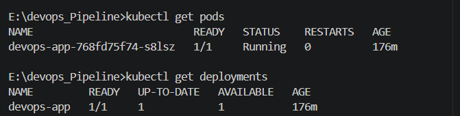
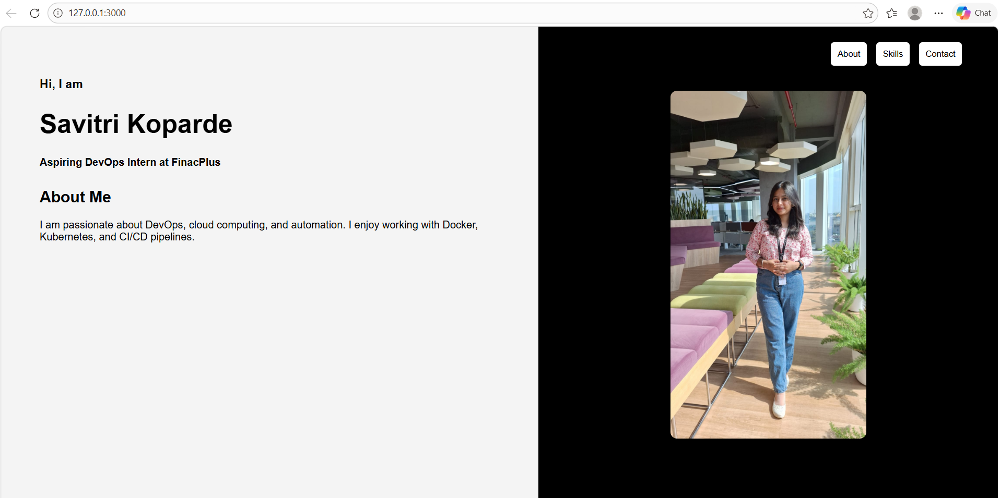

#  CI/CD Pipeline using Git, Jenkins, Docker, and Kubernetes

##  Problem Statement
This project implements a CI/CD pipeline using Git, Jenkins, Docker, and Kubernetes. It automates building and deploying an application whenever code is pushed.

---

##  Objectives
- Automate build & deployment  
- Reduce manual effort  
- Ensure reliability  
- Provide scalability  

---

##  Tools Used
- Git & GitHub  
- Jenkins  
- Docker  
- Kubernetes  
- Python (Flask)  

---

##  CI/CD Workflow
GitHub → Jenkins → Docker → Kubernetes → Application

---

##  Pipeline Explanation
1. Jenkins monitors repo (Poll SCM)  
2. Triggers build on changes  
3. Builds Docker image  
4. Deploys to Kubernetes  
5. App runs with latest version  

---

##  Jenkins Pipeline (Groovy Script)

```groovy
pipeline {
    agent any

    triggers {
        pollSCM('H/2 * * * *')
    }

    parameters {
        string(name: 'REPO_URL', defaultValue: 'https://github.com/Savitri-koparde-hub/DevOps-Case-study.git')
        string(name: 'BRANCH', defaultValue: 'main')
    }

    environment {
        IMAGE_NAME = 'devops-portfolio'
        IMAGE_TAG = "${BUILD_NUMBER}"
    }

    stages {
        stage('Clone Code') {
            steps {
                git branch: "${params.BRANCH}", url: "${params.REPO_URL}"
            }
        }

        stage('Build Docker Image') {
            steps {
                bat "docker build -t %IMAGE_NAME%:%IMAGE_TAG% ."
            }
        }

        stage('Deploy to Kubernetes') {
            steps {
                withKubeConfig(credentialsId: 'kubeconfig-file') {
                    bat "kubectl apply -f k8s/"
                    bat "kubectl set image deployment/devops-app devops-container=%IMAGE_NAME%:%IMAGE_TAG%"
                }
            }
        }
    }

    post {
        success { echo "Deployment Successful" }
        failure { echo "Pipeline Failed" }
    }
}
````

---

##  Project Structure

```
DevOps-Case-study/
├── Jenkinsfile
├── Dockerfile
├── app.py
├── k8s/
│   ├── deployment.yaml
│   └── service.yaml
├── images/
│   ├── jenkins.png
│   ├── docker.png
│   ├── k8s.png
│   └── app.png
└── README.md
```

---

## Setup

1. Clone repo

```
git clone https://github.com/Savitri-koparde-hub/DevOps-Case-study.git
```

2. Run Jenkins pipeline
3. Verify:

```
kubectl get pods
kubectl get svc
```

---

##  Screenshots

### Jenkins Pipeline

<p align="center">
  
</p>

### Docker Build

<p align="center">
  
</p>

### Kubernetes Deployment

<p align="center">
  
</p>

### Application Output

<p align="center">
  
</p>

---

##  Features

* Automated CI/CD
* Docker containerization
* Kubernetes deployment
* Versioning using BUILD_NUMBER

---

##  Security

* Secure Jenkins credentials
* No hardcoded secrets

---


